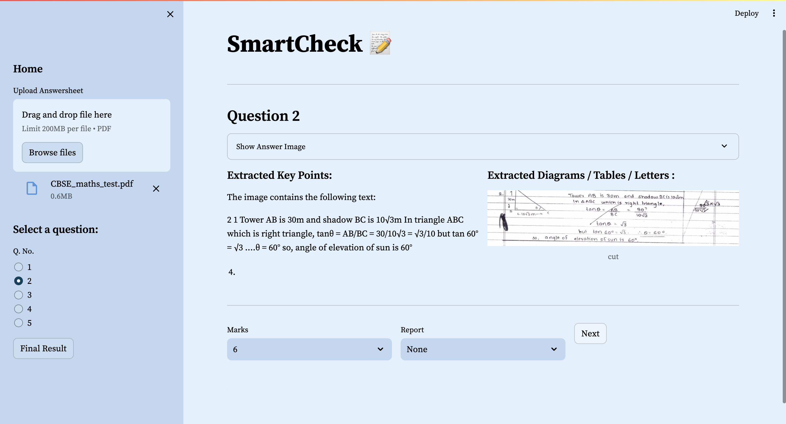

# SmartCheck



AI-based answer sheet checking.

## Usage

### 1. Web App

The simplest way to use this project is through the hosted SmartCheck demo web app [here](https://smartcheck-demo.streamlit.app/)

### 2. Locally

To run this project locally, follow these steps:

1. **Download the Repository:**

Download or clone this repository to your local machine.

2. **Install Dependencies:**

Navigate to the project directory and install the required dependencies using the following command:

 ```bash
pip install -r requirements.txt
```

3. **Create Gemini Vision Pro API Key:**

Obtain a Gemini Vision Pro API key by signing up on their website.

4. **Create Environment Variables:**

Create a `.env` file in the project root directory.
Add the following line to the `.env` file, replacing `your_api_key` with your actual Gemini Vision Pro API key:
```env
GOOGLE_API_KEY=your_api_key
```

5. **Run the App:**
Execute the following command in your terminal to run the Streamlit app:
```bash
streamlit run app.py
```

This will start the local development server, and you can access the SmartCheck app in your web browser at `http://localhost:8501`.

Feel free to explore the various features and functionalities of SmartCheck on the local setup.

## LICENSE

AGPL-3.0 license
